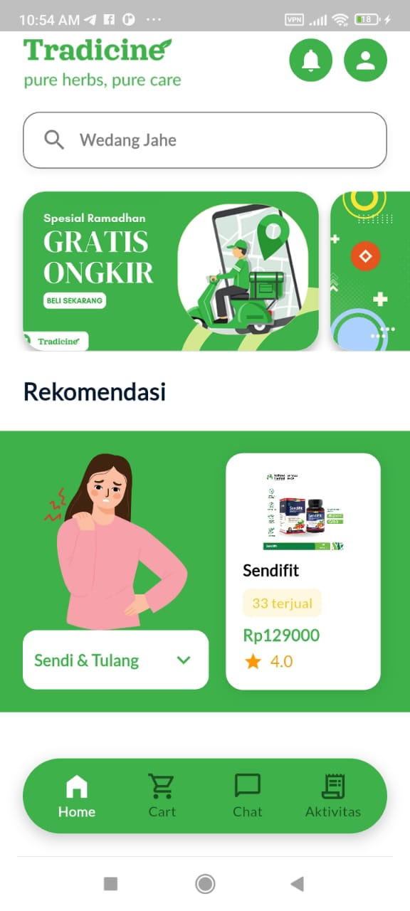
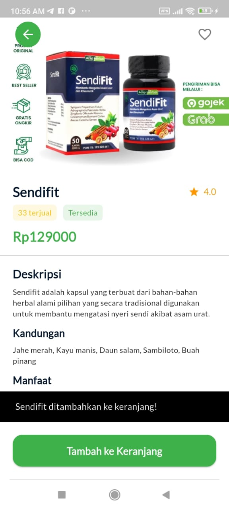
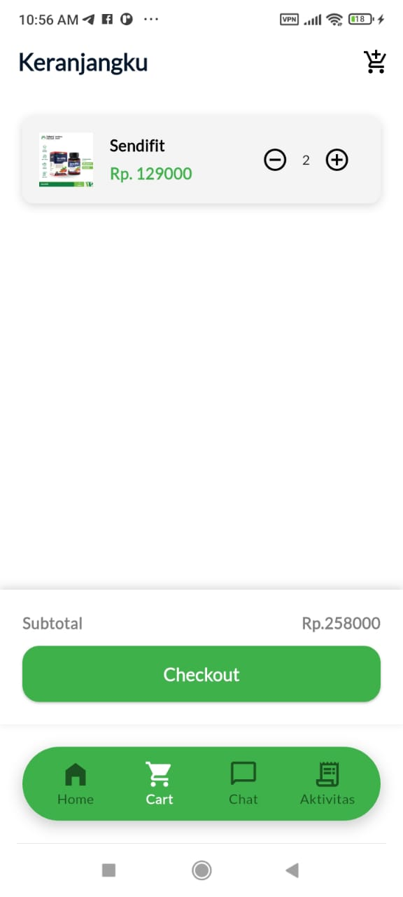
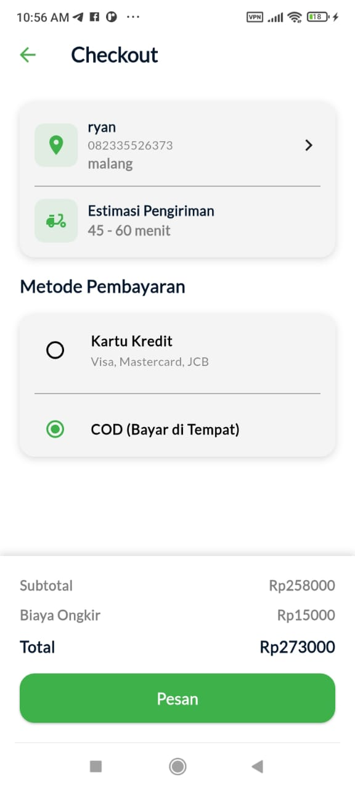
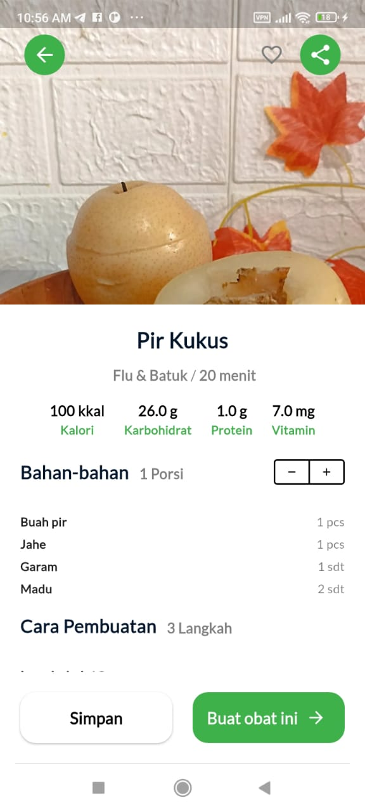
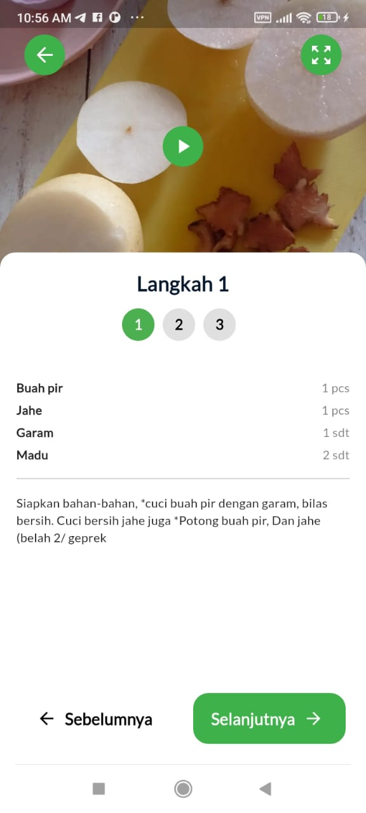
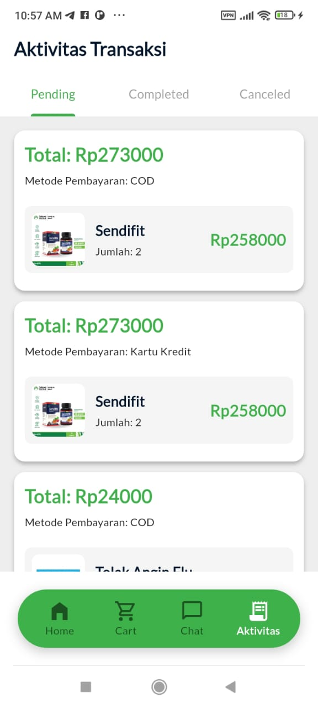

# Tradicine | Aplikasi Obat dan Resep Jamu Tradisional
## Kelompok 10
### Mohammad Dhiriyan Firdaus (23)
### Muhammad Hafidz Shafiqah (25)
### Fabian Nizaro Agung (11)

`Tradicine` adalah aplikasi belanja produk herbal dan resep jamu tradisional yang menawarkan pengalaman belanja dan peracikan ramuan selengkap mungkin.

## Fitur Utama

1. **Home**
   - Banner promo dan carousel rekomendasi
   - Kotak pencarian produk dan resep
   - Akses ke notifikasi dan profil

   

2. **Detail Produk**
   - Gambar dan label (Best Seller, Gratis Ongkir, COD)
   - Deskripsi, kandungan, manfaat, harga, rating
   - Tombol **Tambah ke Keranjang**

   

3. **Keranjang (Cart)**
   - Daftar item di keranjang, kontrol jumlah
   - Menampilkan subtotal
   - Tombol **Checkout**

   

4. **Checkout**
   - Konfirmasi alamat dan estimasi pengiriman
   - Pilihan metode pembayaran (COD, Kartu Kredit)
   - Ringkasan biaya (subtotal + ongkir)
   - Tombol **Pesan**

   

5. **Resep Jamu & Langkah Pembuatan**
   - Informasi nutrisi dan bahan
   - Kontrol porsi dan tombol **Buat obat ini**
   - Instruksi step-by-step dengan teks dan video

   
   

6. **Aktivitas Transaksi**
   - Riwayat pesanan terfilter (Pending, Completed, Canceled)
   - Detail total, metode pembayaran, dan item

   

## Navigasi

Bar navigasi di bagian bawah layar memudahkan perpindahan antar modul:
- Home
- Cart
- Chat
- Aktivitas

